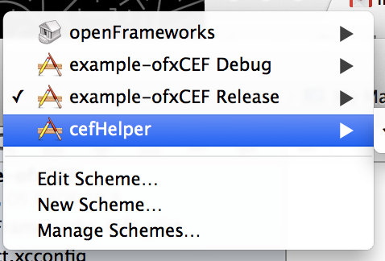
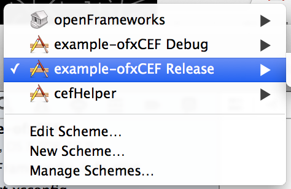

# ofxCEF

an attempt to get CEF working in openframeworks as an alternative to awesomium, berkelium, etc.   [More info on CEF](https://bitbucket.org/chromiumembedded/cef) [wiki](https://bitbucket.org/chromiumembedded/cef/wiki/Home)

## oddities: 

### OSX

we have some issues closing the app because of some awkwardness with autorelease pool ([more info](http://www.magpcss.org/ceforum/viewtopic.php?f=6&t=11441&p=24037&hilit=AutoreleasePoolPage#p24037)).  Thus we do some tomfoolery in ofMain to init CEF before OF, and pass things around. 

Also, because of how CEF works, you will need to compile the helper app first

then compile the demo app itself

